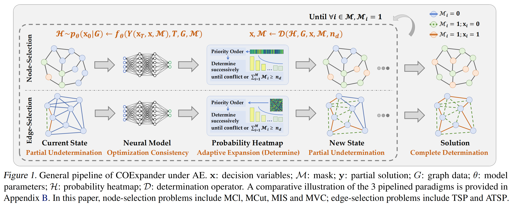

# COExpander [ICML-2025]

## 📚 Brief Introductions

**Official implementation of ICML-2025 paper**: [COExpander: Adaptive Solution Expansion for Combinatorial Optimization](TODO).

**Abstract:** Despite rapid progress in neural combinatorial optimization (NCO) for solving CO problems (COPs), as the problem scale grows, several bottlenecks persist: 1) solvers in the Global Prediction (GP) paradigm struggle in long-range decisions where the overly smooth intermediate heatmaps impede effective decoding, and 2) solvers in the Local Construction (LC) paradigm are time-consuming and incapable of tackling large instances due to the onerous auto-regressive process. Observing these challenges, we propose a new paradigm named Adaptive Expansion AE with its instantiation COExpander, positioned to leverage both advantages of GP and LC. COExpander utilizes informative heatmaps generated by a global predictor, which is learned under the guidance of locally determined partial solutions, to in turn direct the expansion of determined decision variables with adaptive step-sizes. To ensure transparent evaluation, we further take the lead to canonicalize 29 benchmarks spanning 6 popular COPs (MIS, MCl, MVC, MCut, TSP, ATSP) and various scales (50-10K nodes), upon which experiments demonstrate concrete SOTA performance of COExpander over these tasks.



## 📦 Setup

Please follow the steps below to set up the experimental environment for COExpander

> **Step1: check the OS and the ``cuda`` driver**

First, ensure that your experimental environment is a ``linux`` system with ``cuda`` installed. Then, check your nvidia cuda driver.

```bash
nvcc -V
```

> **Step2: install the ``pytorch`` environment with ``cuda``**

Note that you should install ``pytorch`` and related extension packages with the same major version number as your CUDA driver. You can find the quick installation wheels [here](https://pytorch-geometric.com/whl). The following is an installation script for ``python-3.8``, ``pytorch-2.0.1``, and ``cuda-11.7``.

```bash
conda create --name coexpander python=3.8
conda activate coexpander
pip install torch==2.0.1
pip install scipy==1.10.1
pip install --no-index torch-scatter -f https://pytorch-geometric.com/whl/torch-2.0.1+cu117.html
pip install --no-index torch-sparse -f https://pytorch-geometric.com/whl/torch-2.0.1+cu117.html
pip install --no-index torch-spline-conv -f https://pytorch-geometric.com/whl/torch-2.0.1+cu117.html
pip install --no-index torch-cluster -f https://pytorch-geometric.com/whl/torch-2.0.1+cu117.html
```

> **Step3: install ``pytorch-lightning`` and ``WandB``.**

The overall training framework of ``COExpander`` is based on [``pytorch-lightning``](https://github.com/Lightning-AI/pytorch-lightning) and [``wandb``](https://github.com/wandb/wandb). Please install the corresponding packages.

```bash
pip install wandb==0.16.3 # >=0.16.3
pip install pytorch-lightning==2.0.1 # consistent with the PyTorch version
```

> **Step4: install ``ML4CO-Kit``**

We have developed the open-source toolkit [``ML4CO-Kit``](https://github.com/Thinklab-SJTU/ML4CO-Kit), which aims to provide: decoding or post-processing algorithms, traditional solvers, evaluators, data generators, visualization tools, and read-and-write functions for various types of data. ``COExpander`` is based on this open-source toolkit, and the traditional solvers mentioned in ``Appendix D`` can be quickly invoked through this package. 

```bash
pip install ml4co-kit==0.3.2 # stable version (python=3.8~3.11)
```

## ⚡ Datasets and Pretrained Files

> **Step1: test-datasets and pretrained weights**

We use ``google drive`` to store our test-datasets and pre-trained files. Please download them [here](https://drive.google.com/drive/folders/1mKiZmJ2AqiORTCHddQYJH2UJNoboefQV?usp=drive_link).

> **Step2: train-datasets**

We use ``hugging-face`` to store our train-datasets. Please download them [here](https://huggingface.co/datasets/ML4CO/ML4CO-101-SL/tree/main/train_dataset).

## 🚀 Gettiing Started

> **Step1: how to train a model**

First, please download the train-datasets you need to your local machine and freely divide it into training and validation sets. We have provided training scripts for all problems in ``train_scripts`` folder. 

> **Step2: how to test a model**

First, please download the test-datasets and pre-trained files you need to your local machine. We have provided testing scripts for all problems in ``test_scripts`` folder.


## ✨ Citation

If you find COExpander valuable for your research or applied projects:
```bibtex
TODO
```
